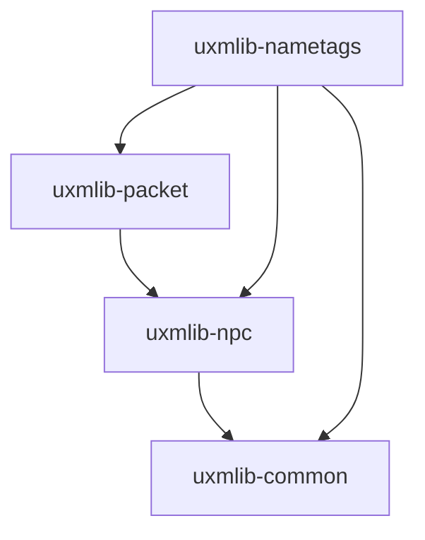

Three modules, `uxmlib-npc`, `uxmlib-packet` and `uxmlib-nametags`, are an in-progress packet
foundation for the things the public API cannot do per viewer: a different nametag colour, tab-list
row or hologram for different players.

<Callout type="warning" title="These APIs are unstable">

They may change without notice until they graduate. The stable toolkit does not depend on them.
Nothing else in uxmLib will break if these change, because nothing else uses them.

</Callout>

| Page | Covers |
|---|---|
| [Pipeline](pipeline.md) | Channel resolution, injection, the reorder watchdog, listeners |
| [Packets](packets.md) | The Mojang-mapped ports: NPC, tab list, text display |
| [Nametags](nametags.md) | Per-viewer nametags over the packet layer |

## Why they exist at all

PacketEvents is the off-the-shelf answer and it is GPL, which is incompatible with uxmLib being MIT
and usable in closed-source plugins. So none of it is borrowed.

The Netty plumbing is re-implemented for Paper 1.21, and the unavoidable NMS is quarantined into
single named classes behind pure ports built against the Mojang-mapped dev bundle. Everything above
those ports carries no `net.minecraft` reference at all and is unit-testable against a fake.

## The dependency shape

`uxmlib-npc` is the pipeline foundation. Despite the name, there is no NPC in it yet.
