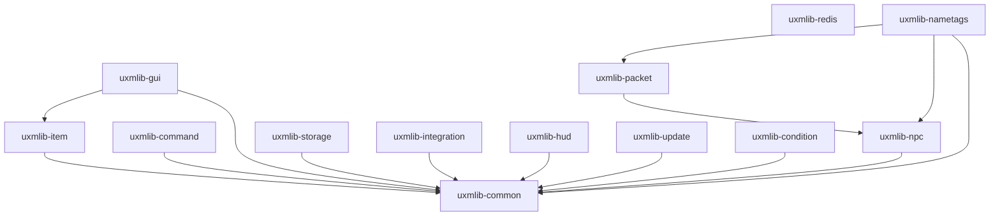

Each module is published separately: pull only what you use. Modules never depend upward, so the
dependency graph is a tree with `uxmlib-common` at the root.

| Module | What it gives you |
|---|---|
| [`uxmlib-common`](common.md) | Scheduler, MiniMessage text, typed config, i18n, particles, helpers |
| [`uxmlib-item`](item.md) | `ItemBuilder`, player heads, serialization, persistent data |
| [`uxmlib-gui`](gui.md) | Inventory menus: simple, paginated, scrolling, storage, typed |
| [`uxmlib-command`](command.md) | Brigadier facade plus an annotation DSL |
| [`uxmlib-storage`](storage.md) | Pooled JDBC, query builder, migrations, caches, row sync |
| [`uxmlib-integration`](integration.md) | Soft-dependency hooks, holograms, toasts, Discord webhooks |
| [`uxmlib-hud`](hud.md) | Sidebar, titles, action bar, boss bars, tablist, animators |
| [`uxmlib-condition`](condition.md) | Config-driven condition and action engines |
| [`uxmlib-update`](update.md) | Notify-only release update checker |
| [`uxmlib-redis`](redis.md) | Binary Redis pub/sub for cross-server messaging |
| [`uxmlib-npc`, `-packet`, `-nametags`](experimental.md) | **Experimental** packet layer |
| `uxmlib-bom` | Version alignment for every module |
| `uxmlib-all` | Every module, and the standalone plugin jar |

## The dependency graph

`uxmlib-redis` depends on nothing internal: it is a standalone primitive with no relational
dependencies at all.

ArchUnit tests enforce that this graph has no cycles and that nothing depends upward. It is a
guarantee, not a convention.
