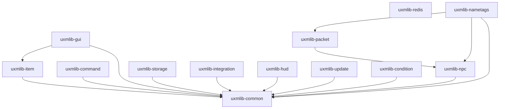

Each module is published separately: pull only what you use. Modules never depend upward, so the
dependency graph is a tree with `uxmlib-common` at the root.

| Module | What it gives you |
|---|---|
| [`uxmlib-common`](common/) | Folia-ready scheduler, MiniMessage text, i18n catalogs, typed config, particles, helpers |
| [`uxmlib-item`](item/) | `ItemBuilder`, player heads with async skin resolution, persistent data, component-safe serialization |
| [`uxmlib-gui`](gui/) | Five menu types, per-viewer items, a safe-by-default click policy, navigation, text input, menus from config |
| [`uxmlib-command`](command/) | A Brigadier facade plus an annotation DSL: typed arguments, flags, cooldowns, conditions, async handlers |
| [`uxmlib-storage`](storage/) | Pooled JDBC, injection-safe query builders, migrations, caching layers, cross-server row sync |
| [`uxmlib-integration`](integration/) | Soft-dependency hooks, native `Display` holograms and widgets, toasts, Discord webhooks, online-data lifecycle |
| [`uxmlib-hud`](hud/) | Diffing sidebar, titles, sticky action bar, boss bars, tablist, text animators |
| [`uxmlib-condition`](condition/) | Config-driven condition and action engines |
| [`uxmlib-update`](update.md) | Notify-only release update checker |
| [`uxmlib-redis`](redis.md) | Binary Redis pub/sub for cross-server messaging |
| [`uxmlib-npc`, `-packet`, `-nametags`](experimental/) | **Experimental** packet layer |
| `uxmlib-bom` | Version alignment for every module |
| `uxmlib-all` | Every module, and the standalone plugin jar |

Each module page opens with what it is for and links to a page per topic inside it. Start at the
module index, not at a topic, if you have not used the module before.

## The dependency graph

`uxmlib-redis` depends on nothing internal: it is a standalone primitive with no relational
dependencies at all.

ArchUnit tests enforce that this graph has no cycles and that nothing depends upward. It is a
guarantee, not a convention.
