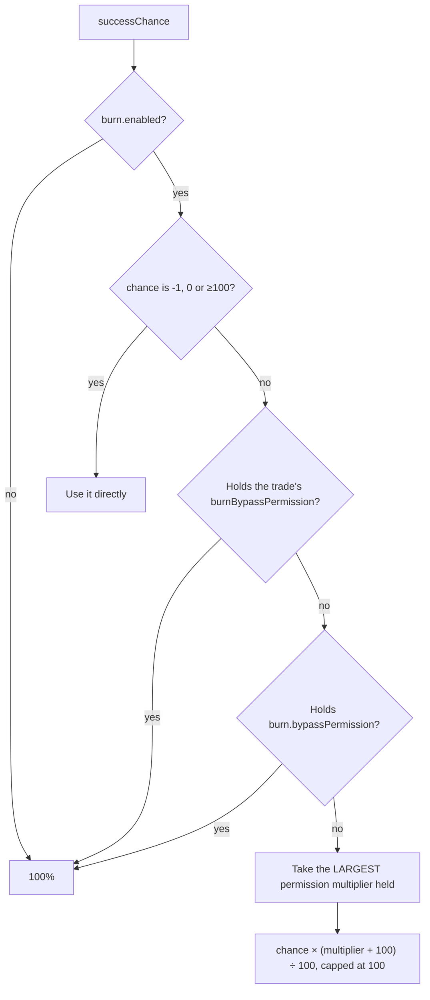

A trade with a success chance below 100 can fail. On failure the materials are gone, the reward is
not given, and the player sees `trade_burned` with the configured sound and particle.

## Turning it on

Globally, in `config.yml`:

```yaml
burn:
  enabled: true
  bypassPermission: "uxmblacksmith.bypassall"
  burnSound: "ENTITY_ENDERDRAGON_GROWL"
  burnParticleEffect: "SMOKE_NORMAL"
  burnParticleCount: 10
  permissionBasedMultipliers:
    uxmblacksmith.burn.1: 5
    uxmblacksmith.burn.2: 10
```

Per trade:

```yaml
item:
  successChance: 85           # 15% chance to burn
  burnBypassPermission: "uxmblacksmith.burn.bypass"
```

| `successChance` | Meaning |
|---|---|
| `-1` | Burn disabled for this trade (always succeeds) |
| `0` | Always burns |
| `1`–`99` | That percent chance of success |
| `100` or more | Always succeeds |

## How the final chance is calculated



With the shipped multipliers:

| Player | Base 85% | Result |
|---|---|---|
| No node | 85 | **85%** |
| `uxmblacksmith.burn.1` (+5) | 85 × 105 ÷ 100 | **89%** |
| `uxmblacksmith.burn.2` (+10) | 85 × 110 ÷ 100 | **93%** |
| Both | largest wins, +10 | **93%** |

Multipliers **do not stack**: the largest held wins. They are also percentage *increases of the
chance*, not percentage points: at a base of 50, `+10` gives 55, not 60.

## Two bypasses, and they mean different things

| Node | Scope |
|---|---|
| `burn.bypassPermission` (`uxmblacksmith.bypassall`) | Every trade on the server never burns |
| `item.burnBypassPermission` (`uxmblacksmith.burn.bypass`) | This one trade never burns |

The per-trade node is configurable, so different tiers can have different bypasses:

```yaml
# Legendary tier, with its own bypass
burnBypassPermission: "uxmblacksmith.burn.bypass.legendary"
```

<Callout type="danger" title="uxmblacksmith.bypassall removes the risk from your whole economy">

It is the global bypass, not a staff convenience. Giving it to a donor rank makes every legendary
recipe on the server a guaranteed craft for them. If you want to sell better odds, sell
`uxmblacksmith.burn.1` and `.2`, or add a higher multiplier of your own.

</Callout>

## Mastery raises it too

```yaml
progression:
  masteryBonuses:
    enabled: true
    successChanceBonusPerLevel: 0.30
    maxSuccessChanceBonus: 12.0
```

Mastery in a category adds up to **12 percentage points** of success chance there, at 0.30 per level
above the first: `(masteryLevel - 1) x 0.30`, so mastery level 41 reaches the cap. This is added to
the result of the permission multiplier, not multiplied by it, and it is the reason a player who has
crafted swords for a month burns fewer of them.

Perks with the `BURN_RESISTANCE` effect add their points here too. `tempered_core` gives +4 per
level to every category; `bulwark_method` gives +3 per level to `armors` only.

## What a burn still gives

A burned trade is not a total loss:

| | Multiplier | Default |
|---|---|---|
| Global XP | `burnedTradeXpMultiplier` | `0.10` |
| Mastery XP | `burnedMasteryXpMultiplier` | `0.25` |

Mastery keeps a quarter of the XP on failure, which means failing at a category still moves you toward
failing less. That is deliberate: it is the mechanic that stops a run of bad luck feeling pointless.

## Showing the odds

The `{success_chance}` GUI placeholder renders the **resolved** chance for that player, including
their multipliers and mastery bonus. Put it in the trade lore:

```yaml
lore:
  - "&7Success rate: &a{success_chance}%"
```

The `bypassText` string appends a marker for players who bypass entirely.
