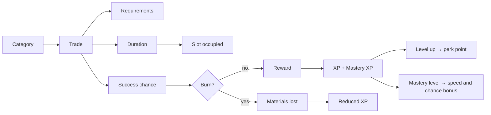

## Category

A themed group of trades, defined in `config.yml` under `categories`. Each names a file in
`categories/` that holds its trades, an icon for the category menu, an optional permission, and an
optional concurrency cap.

```yaml
categories:
  pickaxes:
    name: "Pickaxes"
    permission: ""
    trades: "pickaxes.yml"
    slot: 11
    sameTimeCraftCount: 0
```

A category is also a **mastery key**: the thing a player gains mastery in by crafting from it.

## Trade

One contract. It has a reward, a duration, requirements, and optionally a success chance.

```yaml
trades:
  1:
    1:
      item:
        material: "DIAMOND_PICKAXE"
        name: "&6&lSAGARIS"
        time: 3600
        successChance: 85
      requirements:
        1:
          displayName: "&bDiamond"
          material: "DIAMOND"
          amount: 32
```

Note the **two** levels of number. The outer key is a **page**, the inner one the trade's id within
it. Pages are how a category with forty trades paginates in the menu.

## Requirement

Something the player must hand over or satisfy. A requirement is either consumed (items, money,
points, XP) or merely checked, which is what a PlaceholderAPI condition is.

The full list of types is in [Requirements](../features/requirements.md).

## Slot

A player runs a limited number of trades at once. Slots come from
`uxmblacksmith.slot.1` … `uxmblacksmith.slot.10`, and a player's slot count is **how many of those
nodes they hold**.

<Callout type="warning" title="A player with no slot node has no slots">

Slots are not granted by default. Give `uxmblacksmith.slot.1` to your default group before opening
the server, or nobody can start anything.

</Callout>

## Burn

A trade with `successChance` below 100 may fail. On failure the materials are gone and the reward is
not given, with the `trade_burned` message and the configured sound and particle.

`successChance: -1` disables the risk for that trade: it always succeeds.

Rank permissions raise the chance; see [Burn and risk](../features/burn.md).

## Boost

An item a player right-clicks. A `TIME` boost multiplies the speed of their trades for a duration; an
`INSTANT` boost finishes one trade immediately. Defined in `modules/boosts.yml`.

## Progression

Three linked things:

| | What it is | Granted by |
|---|---|---|
| **Level** | A global blacksmith level | XP from every completed trade |
| **Mastery** | A level per category | Mastery XP from trades in that category |
| **Perks** | A tree of buyable upgrades | Perk points, one per level by default |

Mastery levels passively improve trade speed and success chance. Perks are spent deliberately. Both
are configured under `progression` in `config.yml`.

## How they fit together



A burned trade still grants XP, at `burnedTradeXpMultiplier`, `0.10`, and mastery XP at
`burnedMasteryXpMultiplier`, `0.25`. Failure is not wasted time.
