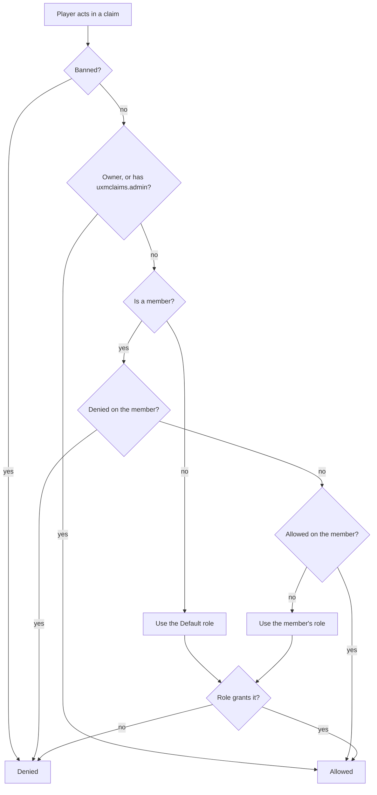

Five ideas. Everything in uxmClaims is one of them.

## Chunks

A chunk is Minecraft's own 16×16 grid cell, from the bottom of the world to the top. Claims are made
of whole chunks: there are no partial claims and no selection wands.

The first chunk a player claims is the **main chunk**. It holds the claim block, the hologram and the
spawn point. Extra chunks are added with `/claim chunk add` and must touch the claim already:

```
  ██              ██ ██            ██ ██
  ██     →        ██ ██     →      ██ ██ ██
                                      ██
```

A chunk whose removal would split the claim in two cannot be removed: the plugin answers
*"Cannot delete this chunk! It connects other chunks to the claim."*

`claimSettings.minDistance` (default `2`) forces a gap in chunks between claims belonging to different
players. `0` lets them sit flush against each other.

## Roles

A role is a named set of [role permissions](../protection/permissions.md). Three always exist and
cannot be deleted:

| Role | Priority | Applies to |
|---|---|---|
| `Owner` | 0 | The owner. Holds every permission implicitly (its permission list is empty on purpose.) |
| `Member` | 1 | The fallback for a member whose role was deleted. |
| `Default` | 2 | Everyone who is **not** a member. This is what visitors get. |

Lower priority is higher rank. Custom roles are created per claim and slot in between.

`Default` is the important one: it is the role that decides what a stranger walking through your land
may do. Shipping it with `MOVE_INSIDE` alone (the shipped default) means outsiders may walk and
nothing else.

## Flags

A [flag](../protection/flags.md) is a rule about the claim itself, not about a player. `TNT_EXPLOSIONS`
does not ask who lit the TNT; it decides whether TNT may break blocks here at all.

Flags are **allow-when-present**. A flag in the claim's set means that thing is permitted. Removing
`FIRE_SPREAD` stops fire spreading; adding it lets fire spread again.

New claims start with `claimSettings.defaultFlags`.

## How a permission check resolves

When a player tries to do something inside a claim, `Claim.hasPermission` runs in this order:



Three things are worth reading twice:

- **A ban beats everything.** A banned player fails before ownership is even checked.
- **Per-member deny beats the role.** You can hand someone the Builder role and still take
  `CONTAINER_OPEN` off them individually.
- **A member whose role was deleted falls back to `Member`,** not to `Default`. They keep member-level
  access until you give them a new role.

## Entitlements

An entitlement is a number that comes from a permission: how many claims, how many chunks, how much a
chunk costs, how long a teleport takes. They live in
[`entitlements.yml`](../config/entitlements-yml.md) and each has a default, a permission prefix, and a
strategy for combining several grants: `STACK` adds them, `MAX` takes the largest, `MIN` takes the
smallest.

`MIN` is used for costs and delays on purpose: giving a rank a *lower* number there is the upgrade.

## Abilities

Separately from all of the above, `uxmclaims.ability.*` decides whether a player may perform an
operation *anywhere at all*, whether they may create claims, delete them, make warps, open vaults.
See [Ability permissions](../permissions/abilities.md).

A player needs the ability node **and** the in-claim role permission. The ability is the server-wide
licence; the role permission is the per-claim one.
