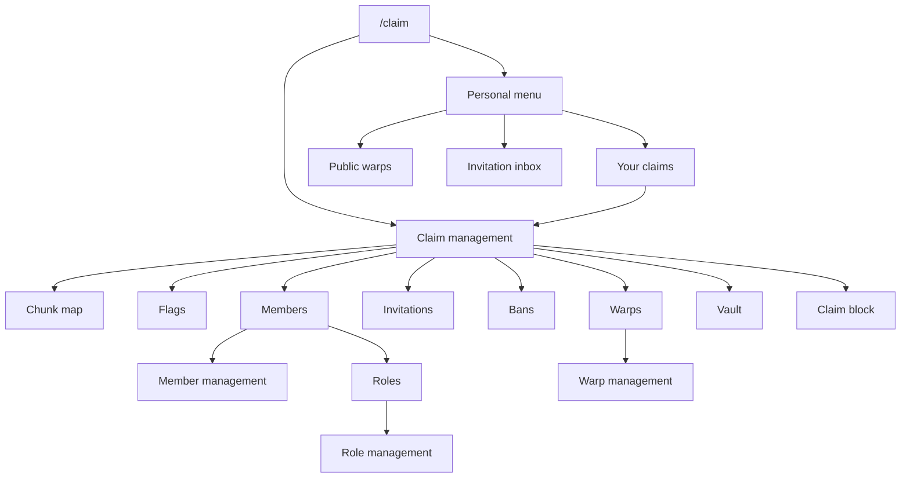

uxmClaims is GUI-first. Every operation in the [command tree](../commands/) has a screen, and a server
can reasonably tell its players exactly one thing: type `/claim`.

## The map

## What opens what

| Command | Screen |
|---|---|
| `/claim` in your own claim | Claim management |
| `/claim` elsewhere | Personal menu |
| `/claim menu` | Personal menu, always |
| `/claim list` | Your claims |
| `/claim select` | Claim picker |
| `/claim warps` | Public warps |
| `/claim invites` | Invitation inbox |
| `/claim chunk view` | Chunk map |
| `/claim vault` | Vault |

## Conventions

- **Left click acts, shift-click does the secondary thing.** On the spawn button, click teleports and
  shift-click sets the spawn. Lore states which is which on every button that has both.
- **Destructive actions route through a confirmation screen**: `common_confirmation`.
- **Text input happens in chat, not in an anvil.** The plugin prompts, you type, and `cancel` aborts.
- **Permissions are honoured in the GUI.** A button you may not use is absent or refuses on click; the
  menu is not a way around [role permissions](../protection/permissions.md).

Every screen is a file in `menu/`. See [Menu layouts](../config/menus.md) for the file format.
