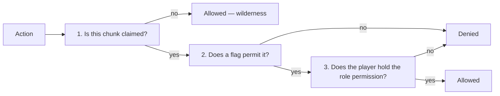

Every protected action passes three gates. All three must say yes.

## 1. Is the chunk claimed?

Unclaimed land is not protected at all. uxmClaims never touches wilderness.

## 2. Does a flag permit it?

A [flag](flags.md) is a rule about the claim, not about a player. `TNT_EXPLOSIONS` decides whether TNT
may break blocks here at all — the owner's TNT included.

Flags are **allow-when-present**. A flag in the claim's set means the thing is permitted, and removing
it forbids it. New claims start with `claimSettings.defaultFlags`.

Not every action has a flag. Flags exist for the things nobody is really "doing": explosions, fire
spread, mob spawning, redstone, liquid flow.

## 3. Does the player hold the role permission?

A [role permission](permissions.md) is about a player. `BLOCK_BREAK` decides whether *this* player may
break blocks here.

The resolution order, exactly as `Claim.hasPermission` runs it:

| Step | Result |
|---|---|
| Banned in this claim | **Denied**, immediately |
| Owner, or holds `uxmclaims.admin` | **Allowed**, immediately |
| A member, with the permission in their *denied* set | **Denied** |
| A member, with the permission in their *allowed* set | **Allowed** |
| A member otherwise | Their role decides; the `Member` role if their role no longer exists |
| Not a member | The `Default` role decides |

## Flags and permissions answer different questions

The distinction is the thing worth internalising.

| | Flag | Role permission |
|---|---|---|
| Applies to | The claim — everyone, owner included | One player |
| Configured per | Claim | Role, with per-member overrides |
| Example | `FIRE_SPREAD` — may fire spread here? | `IGNITE` — may this player light a fire? |
| Example | `PVP` — may players fight here? | `MONSTER_DAMAGE` — may this player hit mobs? |

The owner turning `FIRE_SPREAD` off means fire will not spread in their own base either. That is the
point: flags protect against physics, permissions protect against people.

## The bypasses

| Holder | Effect |
|---|---|
| `uxmclaims.admin` | Passes every ability check and every role permission, in every claim |
| `uxmclaims.bypass.*` | Passes every ability check |
| `uxmclaims.bypass.teleport` | Skips the teleport warmup |

Neither bypasses **flags**. A flag is a property of the world inside the claim, and turning off
`TNT_EXPLOSIONS` stops an admin's TNT too.

## Outside the claim

Two settings reach outside the permission system entirely:

| Setting | Effect |
|---|---|
| `generalSettings.disabledWorlds` | No claims may be created in those worlds |
| `generalSettings.disabledCommandsInClaim` | Those commands are refused for non-members inside any claim |

`disabledCommandsInClaim` is the one people forget. It ships with `sethome` in it, which stops
visitors setting a home inside someone else's base — a common way to get around a ban.
