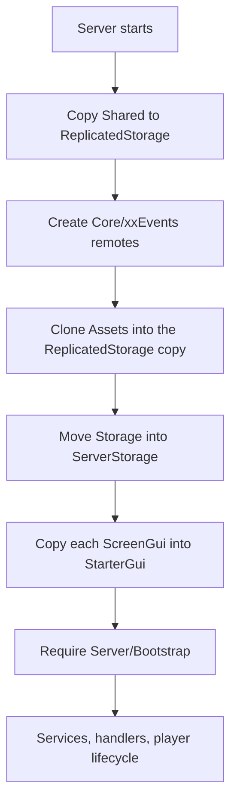

`init.server.luau` at the root of the package is an ordinary `Script`. Roblox runs it
when the server starts, and it installs everything else.

## The order



1. **Shared is replicated.** Any previous copy in `ReplicatedStorage` is destroyed, then
   every child of `Shared/` is cloned into a fresh folder named after the package.
2. **Remotes are created.** A `Core` folder is added to that copy, holding one
   `RemoteEvent` and one `RemoteFunction`. See [The RPC layer](rpc.md).
3. **Assets are previewed.** If the package has `Storage/Assets`, its models are cloned
   into the `ReplicatedStorage` copy so the interface can display them.
4. **Storage is moved.** The whole `Storage` folder is reparented into `ServerStorage`.
   Scripts inside it are disabled during the move and re-enabled after, and sounds are
   stopped, so nothing runs or plays while it is in flight.
5. **The interface is deployed.** Each `ScreenGui` under `Client/` is cloned into
   `StarterGui`, and skipped if a `ScreenGui` of that name is already there.
6. **The server side starts.** `Server/Bootstrap` is required, which initialises the
   profile store, the product's services, the RPC handlers and the player lifecycle.

Step 6 is the last thing that runs, which is why an error in an earlier step shows up as
"the remotes do not exist" rather than as its own message.

## Reading a failure

| Symptom | What it means |
|---|---|
| `Shared is not a valid member of ServerScriptService` | The bootstrap is looking one level too high. It must use `local pkg = script` |
| `<xx>Events is not a valid member` | The bootstrap stopped before step 2. Scroll up in Output for the real error |
| The panel never appears | A `ScreenGui` of that name was already in `StarterGui`, so step 5 skipped it |
| Nothing happens at all | The package is not in `ServerScriptService`, or `init.server.luau` is disabled |

Always read the **first** error in Output, not the last. A failure in step 1 produces a
cascade of "not a valid member" messages afterward, and only the first one is the cause.

## Why it installs itself

The alternative is an install guide with fifteen drag-and-drop steps, and a support queue
full of places where step nine was missed. Here there is one step, and it is repeatable:
delete the runtime copies, press Play, and you are back to a known state.

It also means an update is a folder swap. Nothing you placed by hand has to be found and
replaced.

<Callout type="note" title="The bootstrap runs on every server start, not just the first">

Each new server rebuilds its own copies. There is no persisted install state and nothing
to migrate. If a server comes up in a broken state, restarting it is a real fix rather
than a way of hiding the problem.

</Callout>

## Load order for your own code

If you have a script that needs the system, wait for the runtime copy rather than
assuming it exists:

```lua
local ReplicatedStorage = game:GetService("ReplicatedStorage")
local pkg = ReplicatedStorage:WaitForChild("uxrExampleSystem")
local Settings = require(pkg.Config.Settings)
```

`WaitForChild` is what makes this safe: your script may run before the bootstrap has
finished, and the wait covers exactly that window.
