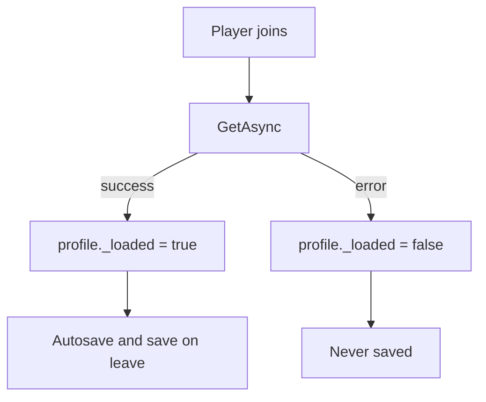

Systems that remember anything about a player keep it in a **profile**: one table per
player, cached in memory while they are in the server and written to a `DataStore` when
it changes.

## The settings

```lua
Profile = {
    Store = "uxrDR_Profile_v1",
    AutosaveSeconds = 60,
},
```

| Key | What it does |
|---|---|
| `Store` | The DataStore name. Changing it starts everyone from scratch |
| `AutosaveSeconds` | How often a loaded profile is written back |

The key inside the store is the player's `UserId`, so profiles follow the account, not
the username.

## What is in it

Every product stores its own shape, but the frame is the same:

```lua
{
    Balance = 0,
    Inventory = {},
    <ProductState> = { ... },
    _v = 1,          -- schema version
    _loaded = true,  -- did the load succeed
}
```

`Balance` and `Inventory` are there for convenience: reward code and shop code can use
them without you adding a currency system. If you already have one, ignore them and grant
through your own.

## The data-loss guard

This is the part worth understanding.



If the load call **fails**, the player gets a fresh default profile in memory so they can
still play, but that profile is flagged `_loaded = false` and is **never written back**.

Without that flag, a transient DataStore outage would look like "this player is new",
and the next autosave would overwrite their real progress with an empty profile. One
five-second outage would wipe everyone online.

The visible cost is that a player who joins during an outage sees their progress reset
for that session. It comes back on their next join. That is the right trade: a session of
confusion beats permanent loss.

<Callout type="warning" title="A load warning in Output is not cosmetic">

`profile load failed for <id>` means that player is running unsaved for the whole
session. If you see it constantly, check that **Studio Access to API Services** is on, or
that you are not over the DataStore request budget.

</Callout>

## When it saves

| Trigger | What happens |
|---|---|
| Autosave timer | Every loaded profile is written |
| Player leaves | Their profile is written, then dropped from the cache |
| Server closes | Every loaded profile is written |

You do not have to call save yourself after granting something. Write to the profile
table and the next autosave picks it up.

## Wiping data

Change `Profile.Store` to a new name, for example `uxrDR_Profile_v2`. The old data is
still in the old store, untouched, so it is reversible: change the name back and
everything returns.

There is no "reset one player" command built in. To do it, clear that key from the store
with a script, or add a command through the product's own hooks.

## Using the profile from your own code

```lua
local ProfileService = require(
    game:GetService("ServerScriptService")
        .uxrExampleSystem.Server.Services.ProfileService
)

local profile = ProfileService:Get(player)
if profile then
    profile.Balance += 100
end
```

`Get` returns `nil` for a player who has left or has not finished loading, so always
check it. Never call `Load` yourself: the player lifecycle already did.
