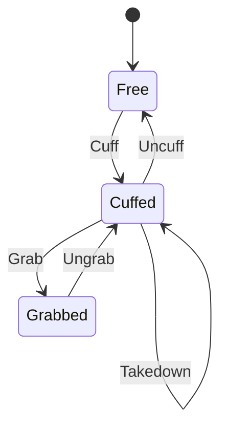

## The three states

Every player carries a `uxrCuffState` attribute:

| State | Value | Means |
|---|---|---|
| Free | `0` | Normal |
| Cuffed | `1` | Slowed, tools confiscated |
| Grabbed | `2` | Welded to the officer and moving with them |



The transitions are the whole rulebook. You cannot grab somebody who is not cuffed, and you
cannot arrest somebody who is not grabbed.

## What each action needs

| Action | Requires | Key |
|---|---|---|
| Cuff | Free | `C` |
| Uncuff | Cuffed or grabbed | `C` |
| Grab | Cuffed | `G` |
| Ungrab | Grabbed | `G` |
| Takedown | Cuffed | `F` |
| Search | Grabbed | `T` |
| Take or remove a tool | Grabbed | In the search panel |
| Rights | Cuffed | `R` |
| Arrest | Grabbed | `P` |

The state is checked again on the server after the permission gate, so a request arriving in
the wrong state returns `BadState`.

`Uncuff` is the one that works from either restrained state: it ungrabs first, then
releases, so an officer never has to press two keys to let somebody go.

## Keybinds

```lua
Keybinds = {
    Handcuff = { key = Enum.KeyCode.C, on = "Cuff", off = "Un Cuff" },
    Grab = { key = Enum.KeyCode.G, on = "Grab", off = "Un Grab" },
    Takedown = { key = Enum.KeyCode.F, text = "Takedown" },
    Search = { key = Enum.KeyCode.T, text = "Search" },
    Rights = { key = Enum.KeyCode.R, text = "Rights" },
    Arrest = { key = Enum.KeyCode.P, text = "Arrest" },
},
```

`on` and `off` are the two labels for the toggling actions; `text` is the single label for
the rest. The key name is stamped onto the billboard buttons automatically, so changing a
key changes what players are told to press.

Use a valid `Enum.KeyCode`. Letters are `Enum.KeyCode.A` through `.Z`.

## Targeting

There is no clicking. The client picks the **nearest valid target** every frame and outlines
them, where valid means:

| | |
|---|---|
| Not you | |
| You are holding the handcuff tool | |
| A team pair exists between you | |
| Nobody else has them restrained | |
| Within that pair's `ActivationDistance` | |

Walk away and the target clears; walk up to somebody else and it switches. The current
target gets a `Highlight` named `uxrHighlight`.

The billboard above their head shows the buttons available for their current state, and the
same set appears in the on-screen bar.

## Confiscation

Cuffing takes **every** tool the suspect has, from both their character and their backpack,
and holds them server side.

| Event | Result |
|---|---|
| Uncuffed | Every tool goes back to their backpack |
| Officer takes a tool | It moves into the officer's backpack |
| Officer removes a tool | It is destroyed |
| Jailed | Everything still confiscated is destroyed |
| They respawn or die | Everything is returned and they are freed |
| They leave the game | Nothing is returned, because there is nobody to return it to |

<Callout type="warning" title="Arresting somebody destroys what they were carrying">

`forfeitAndClear` runs as part of committing an arrest, and it destroys the confiscated
tools rather than storing them.

That suits a roleplay game where contraband is meant to be gone. If your game has valuable
tools that should survive a sentence, take them with `TakeTool` first so the officer holds
them, or change that behaviour.

</Callout>

## Cuffed movement

```lua
DefaultWalkSpeed = 16,
DefaultJumpHeight = 7.2,
CuffedWalkSpeed = 4,
CuffedJumpHeight = 1.4,
```

A cuffed player shuffles. `0` for either value freezes that ability entirely.

The defaults are restored on release, so set `DefaultWalkSpeed` to whatever your game
actually uses. If your game gives players a speed of 24, leaving this at 16 means every
release is a stealth nerf.

## Grab

Grabbing welds the suspect's root part to the officer's, at `GrabOffset`:

```lua
GrabOffset = Vector3.new(0, 0, 3),
```

Three studs in front. Their humanoid is put into `PlatformStand`, and network ownership of
their root part is handed to the officer so the movement is smooth on the officer's screen.

Letting go restores all three.

## Takedown

A toggle, only while cuffed. Down means speed and jump both zero and a takedown animation;
pressing `F` again stands them back up at cuffed speed.

Takedown does not survive a state change: cuffing, grabbing or releasing resets it.

## Rights

Broadcasts the team pair's `RightsText` to every client as a bubble over the officer, on a
per-officer cooldown:

```lua
RightCooldown = 10,
```

It is flavour, not mechanics. Nothing about the arrest depends on whether rights were read.

## What breaks a restraint

Restraints are not permanent. Any of these frees the suspect:

| Event | Effect |
|---|---|
| The suspect respawns or dies | Freed, tools returned |
| The officer dies | Every suspect they hold is freed |
| The officer unequips the handcuff tool | Every suspect they hold is freed |
| The officer leaves | Every suspect they hold is freed |
| The suspect leaves | See the leave protection in [Arrest and jail](jail.md) |

The officer losing their cuffs releasing their suspect is the important one: it means a
suspect is never stuck because an officer switched tools and wandered off.

## Rate limits

```lua
InputDebounce = 0.2,
ActionRateLimit = 0.4,
```

The first is the client's guard against double taps; the second is the server's, per officer
per action. A faster request returns `Cooldown`.

Leave `ActionRateLimit` above zero. It is the anti-spam guard, and every action behind it
does real work.

## The billboard

The action buttons live in a `BillboardGui` named `HandcuffBillboard`, cloned onto every
character's `HumanoidRootPart` at spawn, with a second one on the head.

Frames shown per state:

| State | Frames |
|---|---|
| Free | `HandcuffFrame` |
| Cuffed | `UnHandcuffFrame`, `RightsFrame`, `GrabFrame`, `TakedownFrame` |
| Grabbed | `UnGrabFrame`, `SearchFrame`, `ArrestFrame` |

Each frame needs a `ButtonText` label for the action name and a `Button` for the key name.
Both are filled in from `Config/Actions.luau` when the billboard is cloned.

The same frame names drive the on-screen bar under `MobileFrame.ListFrame`, where each
frame's button fires the same action. Restyle both freely; keep the names.
