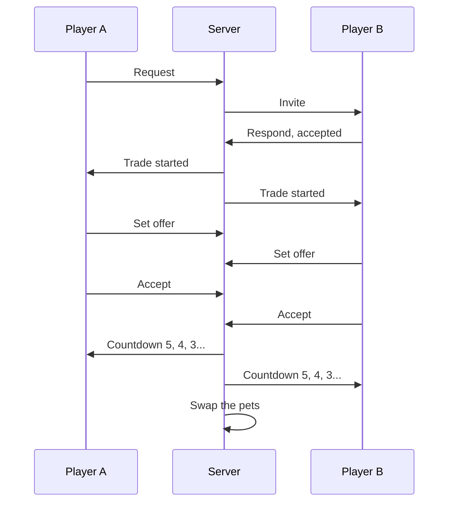

Two players swap pets. Both sides offer, both sides accept, a countdown runs, and the pets
change hands.

```lua
Trade = { ConfirmSeconds = 5 },
```

## The flow



## Invites

One outstanding invite per player. A second invite to the same person replaces the first.

| Refusal | Means |
|---|---|
| `InTrade` | You are already trading |
| `BadTarget` | No such player, or yourself |
| `TargetBusy` | They are already trading |
| `TargetClosed` | They have trading switched off |

Declining tells the sender. Cancelling an invite you sent tells the recipient.

## Trading switched off

A player can close themselves to trade requests, which refuses every incoming invite with
`TargetClosed`.

The setting is per session and is not saved: a player who closes trading and rejoins is open
again. Persist it yourself if your game needs it to stick.

## Offers

Either side sets their whole offer at once. The server filters it down to pets that are
actually theirs, are not locked and are not listed twice.

<Callout type="warning" title="Changing your offer resets both accepts">

Any change to either offer clears both players' accept flags.

That is the anti-scam property that matters: nobody can accept a trade and then have the
other side swap in something worse. It also means a last-second addition costs you both an
extra click.

</Callout>

## What cannot be traded

| | |
|---|---|
| Locked pets | Filtered out of the offer, and checked again at swap time |
| Pets you do not own | Filtered out |
| Duplicated entries | Deduplicated |

Locking a pet is the player's own protection, and it is checked twice: once when the offer
is set and once immediately before the swap.

## The countdown

```lua
ConfirmSeconds = 5,
```

When both sides accept, a countdown runs and both see the number tick down. Either player
can still cancel during it, and cancelling ends the trade with nothing swapped.

`0` swaps the instant both accept.

Keep it at 5. The countdown is the last chance for a player who has just realised what they
are giving away, and its absence is what makes trade scams work.

## The swap

Both sides' pets are validated one final time, removed from their owners, and added to the
other player.

<Callout type="info" title="Traded pets arrive as new entries">

A pet is removed and re-added rather than moved, so it gets a new internal id on the
receiving side and arrives unlocked and unequipped.

Nothing a player can see changes: same species, same variant, same power. It matters only if
you are storing pet ids in your own scripts.

</Callout>

If either side's offer no longer validates at that moment, the trade ends as `invalid` and
nothing changes hands.

## Ending a trade

| Reason | Cause |
|---|---|
| `completed` | The swap happened |
| `cancelled` | Somebody pressed cancel |
| `declined` | The invite was refused |
| `left` | Somebody left the game |
| `invalid` | The final validation failed |
| `error` | A profile went missing |

A player leaving ends their trade immediately, so there is no way to disconnect mid-swap and
keep both sides.

## Turning trading off

There is no master switch in the config. Remove the trade panel from the interface, or add
your own guard in front of the trade handlers.

Setting `ConfirmSeconds` very high is not a substitute: the trade still completes, it just
takes longer.
